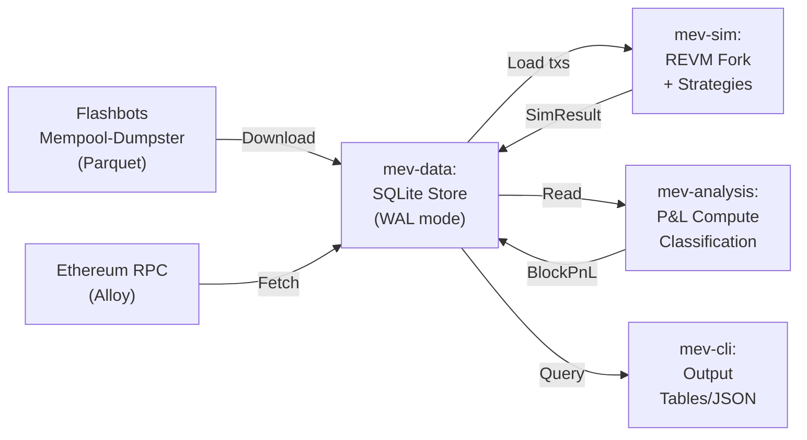

# MEV Backtest Toolkit

Educational Rust toolkit for replaying historical Ethereum blocks and understanding MEV mechanics through simulation. **Analysis only — this project does NOT submit transactions to any relay, RPC, or network.**

## Prerequisites

- **Rust**: 1.82+ (stable, `rustup default stable`)
- **RPC endpoint**: Alchemy, Infura, or local Reth (for block fetching)
- **Disk**: ~2GB for SQLite snapshots + Parquet caches
- **Time**: 5–10 minutes per 1000-block backtest

## Quick Start

### 1. Clone and Build
```bash
git clone https://github.com/your-org/mev-backtest-toolkit.git
cd mev-backtest-toolkit
cargo build --release
```

### 2. Fetch 1 Day of Mempool Data
```bash
export RPC_URL=https://eth-mainnet.g.alchemy.com/v2/YOUR_KEY
cargo run --release --bin mev-cli -- \
  download-mempool \
  --date 2025-02-22 \
  --data-dir ./data
```
(Downloads ~50MB Flashbots Parquet file)

### 3. Fetch On-Chain Block Data
```bash
cargo run --release --bin mev-cli -- \
  fetch-blocks \
  --start-block 19500000 \
  --end-block 19500010 \
  --rpc-url "$RPC_URL" \
  --db-path ./data/mev.db
```

### 4. Simulate Block Execution
```bash
cargo run --release --bin mev-cli -- \
  simulate \
  --block 19500005 \
  --db-path ./data/mev.db \
  --algorithm egp
```

### 5. Analyze Results
```bash
cargo run --release --bin mev-cli -- \
  status \
  --db-path ./data/mev.db
```

Output shows: blocks ingested, simulated MEV, P&L capture rates.

---

## Architecture



**Flow:**
1. **Ingest**: Fetch historical mempool data (Flashbots) and on-chain blocks (Alloy RPC)
2. **Store**: Persist in SQLite with WAL mode for concurrent reads
3. **Simulate**: Fork EVM at block N-1, apply ordering/strategies, compute results
4. **Analyze**: Calculate P&L, capture rates, MEV classifications
5. **Export**: JSON, CSV, ASCII tables via CLI

---

## Key Concepts

| Concept | Definition | Learn More |
|---------|-----------|-----------|
| MEV | Maximal Extractable Value: profit available from transaction ordering | [docs/mev-concepts-glossary.md](docs/mev-concepts-glossary.md#mev) |
| Arbitrage | Two-pool DEX opportunity: buy low, sell high | [docs/mev-concepts-glossary.md](docs/mev-concepts-glossary.md#arbitrage) |
| Sandwich Attack | Attacker front-runs + back-runs victim; captures spread | [docs/mev-concepts-glossary.md](docs/mev-concepts-glossary.md#sandwich-attack) |
| Bundle | Atomic sequence of txs: all succeed or all revert | [docs/mev-concepts-glossary.md](docs/mev-concepts-glossary.md#bundle) |
| Effective Gas Price (EGP) | min(maxFeePerGas, baseFee + priorityFeePerGas) for EIP-1559 | [docs/mev-concepts-glossary.md](docs/mev-concepts-glossary.md#effective-gas-price) |
| Base Fee | Ethereum dynamic fee burned per gas; set by protocol | [docs/mev-concepts-glossary.md](docs/mev-concepts-glossary.md#base-fee) |
| REVM | Ethereum Virtual Machine lib (Rust): fast execution, no networking | [REVM Docs](https://github.com/bluealloy/revm) |
| Capture Rate | Simulated value ÷ actual block value; measure of ordering impact | [crates/mev-analysis/src/pnl.rs](crates/mev-analysis/src/pnl.rs#L187) |

---

## Comparison: This Toolkit vs. rbuilder vs. Brontes

| Aspect | This Toolkit | rbuilder | Brontes |
|--------|--------------|----------|---------|
| **Purpose** | Educational backtest + analysis | Production block builder | Closed-source MEV research |
| **Language** | Rust (safe) | Rust + Go | Proprietary |
| **Scope** | Historical replay only | Real-time ordering + relay | Real-time + API |
| **Network Effect** | None (local SQLite) | Requires block relay | Requires relay infra |
| **Complexity** | ~7k LOC | ~50k LOC | Unknown |
| **Ordering Algorithms** | EGP, profit-sort, custom | Full PBS integration | Proprietary |
| **MEV Detection** | Sandwich, arbitrage | Full spectrum (MEV-Inspect) | Research only |
| **Gas Simulation** | REVM 19 (accurate) | REVM 19 | Proprietary |
| **Output** | JSON, CSV, tables | Builder API | N/A |
| **License** | MIT | AGPL-3.0 | Proprietary |

**When to use this toolkit:**
- Learning MEV mechanics
- Backtesting ordering strategies
- Analyzing historical blocks without live RPC cost
- Building custom MEV classifiers

---

## Performance Reference

Benchmarks (MacBook Pro M1, release build):

| Operation | Time | Notes |
|-----------|------|-------|
| Sort 100 txs by EGP | **15.5 µs** | Large mempool simulation |
| Apply nonce constraints (50 txs) | **6.4 µs** | Filter gaps per sender |
| Detect arbs (10 pools) | **3.2 µs** | All pairwise evaluations |
| Format 10k Wei → ETH | **886 µs** | Typical analysis loop |
| Single tx simulate (warm state) | **< 5ms** | REVM + state cache |
| Fetch 1 block via RPC | **100–500ms** | Network-bound |
| SQLite batch insert (1k rows) | **< 50ms** | WAL mode |

**Scaling**: Process ~1000 blocks in 10–15 minutes with local RPC.

---

## Contributing

### Adding a New MEV Strategy

1. **Define detection logic** in [crates/mev-sim/src/strategies/](crates/mev-sim/src/strategies/):
   ```rust
   // crates/mev-sim/src/strategies/my_strategy.rs
   pub fn detect_my_opportunity(
       txs: &[MempoolTransaction],
       evm: &EvmFork,
   ) -> Result<Vec<Opportunity>> {
       // Scan for your pattern
       // Return list of opportunities
   }
   ```

2. **Add unit tests** (required by AGENTS.md):
   ```rust
   #[cfg(test)]
   mod tests {
       #[test]
       fn detects_simple_case() { ... }
   }
   ```

3. **Export from [lib.rs](crates/mev-sim/src/lib.rs)**:
   ```rust
   pub mod strategies;
   pub use strategies::my_strategy;
   ```

4. **Integrate into CLI** in [crates/mev-cli/src/](crates/mev-cli/src/):
   ```rust
   let opportunities = my_strategy::detect_my_opportunity(&txs, &evm)?;
   ```

5. **Verify**:
   ```bash
   cargo check
   cargo clippy -- -D warnings
   cargo test --package mev-sim
   ```

6. **Commit** (after testing):
   ```bash
   git add -A
   git commit -m "P-N: Add my-strategy detection"
   ```

### Code Standards

- **Error handling**: Always use `eyre::Result` in library crates
- **Logging**: `tracing::info!()` / `debug!()`, never `println!`
- **Testing**: ≥1 unit test per public function (happy path minimum)
- **Documentation**: `///` on all public items; module-level `//!` doc comments
- **Benchmarking**: Use criterion if performance-critical

See [AGENTS.md](AGENTS.md) for complete rules.

---

## FAQ

**Q: Why SQLite instead of PostgreSQL?**  
A: Zero infrastructure; rbuilder uses same pattern. Fast for historical analysis.

**Q: Can I use this to submit bundles?**  
A: No. This project analysis-only. Add transaction submission at your own risk.

**Q: How accurate is the REVM simulation?**  
A: ~99% for transfers; contract opcodes require state injection. See `crates/mev-sim/src/evm.rs`.

**Q: What's the latency for a full backtest?**  
A: ~1 minute per 100 blocks with warm RPC cache. Network I/O dominates.

---

## Resources

- **Architecture**: [spec.md](spec.md)
- **MEV Concepts**: [docs/mev-concepts-glossary.md](docs/mev-concepts-glossary.md)
- **Coding Standards**: [AGENTS.md](AGENTS.md)
- **Block Fetcher Plan**: [BLOCK_FETCHER_PLAN.md](BLOCK_FETCHER_PLAN.md)
- **EVM Fork Plan**: [EVM_FORK_PLAN.md](EVM_FORK_PLAN.md)
- **Mempool Parser Plan**: [MEMPOOL_PARSER_PLAN.md](MEMPOOL_PARSER_PLAN.md)

---

## License

MIT — Use freely for educational and research purposes.

